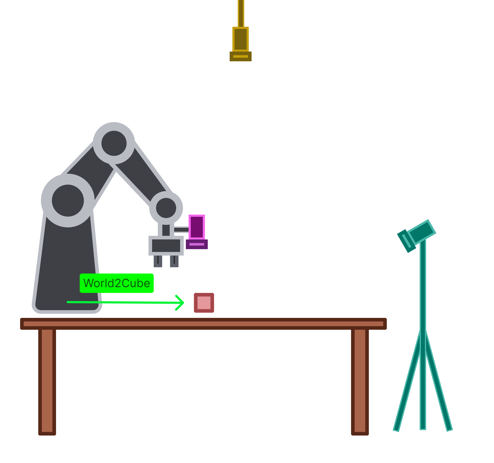

Launch file : `code/catkin_ws/src/object_finder/launch/hsv_cubes.launch`
Script : `code/catkin_ws/src/object_finder/nodes/hsv_cubes_finder.py`




## Settings
---

### Broadcast Camera Position
Add camera position estimate gathered from 
```
code/catkin_ws/src/camera_calibration/calibration_resuslts/eye_{to/in}_hand/{camera}/{filename}
``` 
to the camera position broadcaster in :
```
code/catkin_ws/src/camera_estimate_broadcaster/camera_transforms/my_cameras.json
```

Example
```json
{  
	"EYE_IN_HAND": {  
		"frame_id": "panda_hand",  
		"child_frame_id": "eye_in_hand",  
		"translation": {  
			"x": 0.033610434992842025,  
			"y": -0.03902005597466658,  
			"z": 0.07196366750071341  
		},  
		"rotation": {  
			"x": 0.008611962536564623,  
			"y": 0.0036755254521442316,  
			"z": 0.693069539038641,  
			"w": 0.7208099185434986  
	}  
},
	...
}
```


### Object Finder

**Launch Config**
Change camera stream topic
```xml
<arg name="camera_topic" default="/{camera}/color/image_raw"/>
```

**Things to change in the code**
1. Parent name for the cube
line 194 in `hsv_cubes_finder.py` 
```python
TFPublish.publish_static_transform(
    publisher=self.center_broadcaster,  
	parent_name='cam_top',  #camera/cam_front
	child_name=f'cube',  
	rotation=[0., 0., 0., 1.],  
	translation=self.position
)
```

2. Camera Depth Topic
line 52 in `hsv_cubes_finder.py` 
```python:
self.aligned_depth_subscriber = rospy.Subscriber(									'/cam_top/aligned_depth_to_color/image_raw', 
	Image,  
	self.camera_depth_aligned_callback
)
```

## Start Everything
---
1. Start Arm
2. Start Camera
3. Start Object Finder
```
roslaunch object_finder hsv_cubes.launch
```


## Find a Cube
---

**Controls Overview**
```
u = pick up target
d = put down target
m = pick up target and move to random location
q = quit
o/p = scale window up/down
k/l = scale roi for color picking
```

**Sliders Overview**
```
hue = color spectrum 
value = color brightness
saturation = gray to colorful
fill = fill holes in the segment
noise = remove small segments
```


**Find Cube**
1. Click on the colored cube to pick up
2. Change sliders to only segment the target

**Moving the Cube**
Press `[u]` for pick up target
Press `[d]` for put down target
Press `[m]` for random put down target
